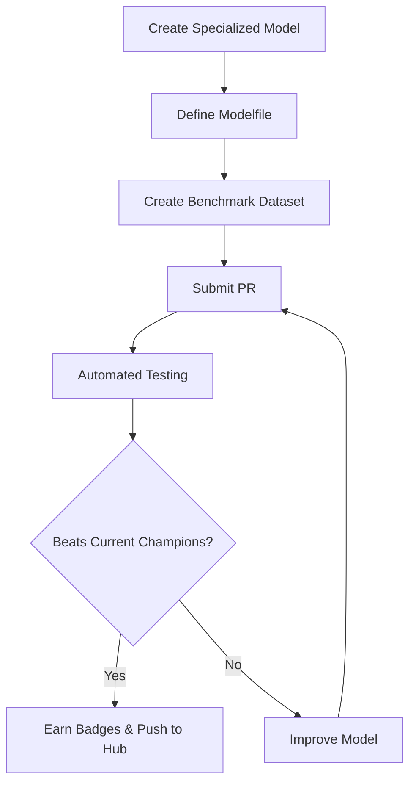

# **Nexus Agents: Competitive Hub for Specialized LLMs**

## **Overview**
Nexus Agents is an open-source competitive platform for developing, evaluating, and sharing specialized language models using Ollama. Think of it as the Olympics for AI models - where each task is a different sport, and models compete to be the fastest, most accurate, or most efficient.

Instead of building general-purpose LLMs, we focus on creating highly specialized models that excel at specific domains and tasks. Each model competes for championship badges, and winners are automatically published to the Ollama Hub for worldwide access.

## **How It Works**

### The Competitive Platform
1. **Model Definition**: Models are defined using Ollama Modelfiles for easy sharing and reproduction
2. **Automated Evaluation**: Each model is tested against task-specific benchmarks
3. **Badge Competition**: Models compete for championship badges in different categories
4. **Quality Gates**: PRs are only merged if models beat existing benchmarks
5. **Performance Tracking**: Comprehensive metrics for quality, latency, and resource usage
6. **Automatic Publishing**: Champion models are pushed to Ollama Hub instantly

### Championship Badges 🏆
Models compete for these prestigious badges:
- 🚀 **Speed Champion**: Lowest latency (TTFT + token generation)
- 🎯 **Accuracy Master**: Highest quality scores  
- 🪶 **Lightweight Leader**: Lowest memory footprint
- 🏆 **Overall Champion**: Best balance of all metrics

Multiple models can hold different badges for the same task, creating healthy competition across different optimization goals.

### Example Workflow


## **Featured Task: Child Trauma Assessment**
Our flagship task showcases the platform's capabilities - a specialized LLM designed to assist in psychological assessment of children in conflict zones. Built on Gemma 3B, this model provides trauma-informed responses while maintaining professional boundaries and safety protocols.

**Key Features:**
- Initial trauma screening guidance
- Coping strategy recommendations  
- Urgent case identification
- Cultural sensitivity handling
- Report generation assistance

This real-world application demonstrates how specialized models can address critical humanitarian needs while competing on technical excellence.

## **Available Tasks**
Each task is self-contained with:
- Model definition (Modelfile)
- Benchmark dataset
- Evaluation metrics
- Championship leaderboard
- Documentation

Current tasks:
1. **Child Trauma Assessment**: Psychological assessment support for children living in regions under conflicts/wars
2. *(More tasks coming - submit yours!)*

## **Project Structure**
```
ollamaforge/
├── tasks/                  # Each specialized task
│   └── child_trauma_assessment/
│       ├── model/         # Ollama model definition
│       ├── benchmarks/    # Test datasets
│       └── evaluation/    # Metrics and evaluation
├── docs/                  # Documentation
└── .github/
    └── workflows/         # CI/CD pipelines
```

## **Contributing**

### Becoming a Champion
Want to dethrone the current champions? Here's how:

1. **Choose Your Battle**: Pick speed, accuracy, efficiency, or overall excellence
2. **Fork & Improve**: Enhance existing models or create new ones
3. **Local Testing**: Use our evaluation scripts to benchmark locally
4. **Submit PR**: Demonstrate improvements over current champions

**Important**: One task per PR to maintain clean evaluation pipelines.

For detailed contribution guidelines, see [CONTRIBUTING.md](docs/CONTRIBUTING.md).

### Adding a New Task
1. Create directory under `tasks/`
2. Provide:
   - Modelfile for your specialized model
   - Benchmark dataset with test cases
   - Evaluation metrics (or use standard ones)
   - Task documentation
3. Submit PR with comprehensive benchmarks

For complete submission guidelines, check out [docs/guidelines.md](docs/guidelines.md).

### Improving Existing Tasks
1. Fork the repository
2. Modify the Modelfile or benchmarks
3. Test locally using Ollama
4. Submit a PR

Your PR must demonstrate:
- Improved quality scores
- Maintained or improved performance
- No regression in existing test cases

## **Local Development**

1. Install Ollama:
   ```bash
   curl -fsSL https://ollama.com/install.sh | sh
   ```

2. Clone and setup:
   ```bash
   git clone https://github.com/Dahimi/Nexus-Agents.git
   cd Nexus-Agents
   python -m venv venv
   source venv/bin/activate  # On Unix/MacOS
   pip install -r requirements/requirements.txt
   ```

3. Test a task locally:
   ```bash
   cd tasks/child_trauma_assessment
   ollama create trauma-model -f model/Modelfile
   python ../../scripts/evaluate_task.py child_trauma_assessment
   ```

## **The Path to Ollama Hub**
When your model claims a championship:
1. Automatic push to Ollama Hub with badges displayed
2. Instant worldwide availability via `ollama pull`
3. Credit as model creator/contributor
4. Performance tracking and leaderboard placement

*Note: We're currently fine-tuning our CI/CD pipeline for seamless Ollama Hub integration - manual publishing may be needed temporarily.*

## **Future Roadmap**
1. **More Specialized Tasks**: Adding models for:
   - Medical diagnosis assistance
   - Technical documentation
   - Educational assessment
   - Local language processing
2. **Enhanced Evaluation**: 
   - GPU performance metrics
   - Cross-task evaluation
   - A/B testing framework
3. **Community Features**:
   - Model leaderboards
   - Usage analytics
   - Collaborative improvement tools

## **Meet Our Team**
- [Soufiane DAHIMI](https://www.linkedin.com/in/soufiane-dahimi/)

## **License**
This project is licensed under the MIT License - see the [LICENSE](LICENSE) file for details.


