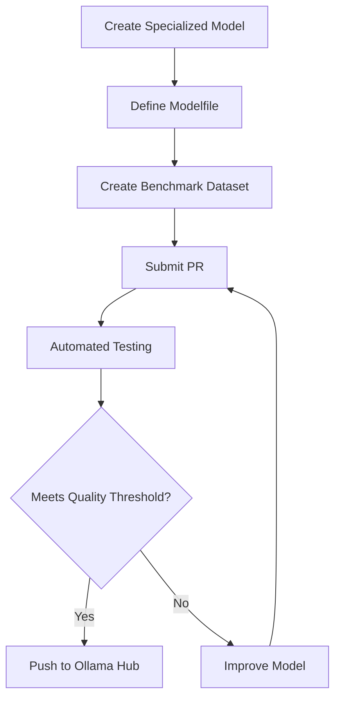

# **Nexus LLM Hub: Open-Source Platform for Specialized Language Models**

## **Overview**
Nexus LLM Hub is an open-source platform for developing, sharing, and evaluating specialized language models using Ollama. Instead of building general-purpose LLMs, we focus on creating highly specialized models for specific domains and tasks - from medical assessment to technical documentation.

Our mission is to foster a community of specialized LLMs where each model excels at a specific task, making AI more efficient and accessible. Each successful model is automatically published to the Ollama Hub, making it instantly available to users worldwide.

## **How It Works**

### The Platform
1. **Model Definition**: Models are defined using Ollama model files (Modelfiles), making them easy to share and reproduce
2. **Automated Evaluation**: Each model is automatically tested against domain-specific benchmarks
3. **Quality Control**: PRs are only merged if the model beats existing benchmarks
4. **Performance Tracking**: Comprehensive metrics for quality, latency, and resource usage
5. **Automatic Publishing**: Successful models are pushed to Ollama Hub for immediate use

### Example Workflow


## **Available Tasks**
Each task in Nexus LLM Hub is self-contained with its own:
- Model definition (Modelfile)
- Benchmark dataset
- Evaluation metrics
- Documentation

Current tasks:
1. **Child Trauma Assessment**: Specialized model for psychological assessment of children in conflict zones
2. *(More coming soon)*

## **Project Structure**
```
nexus-llm-hub/
├── tasks/                  # Each specialized task
│   └── child_trauma_assessment/
│       ├── model/         # Ollama model definition
│       ├── benchmarks/    # Test datasets
│       └── evaluation/    # Metrics and evaluation
├── docs/                  # Documentation
└── .github/
    └── workflows/         # CI/CD pipelines
```

## **Contributing**

### Adding a New Task
1. Create a new directory under `tasks/`
2. Provide:
   - Modelfile for your specialized model
   - Benchmark dataset
   - Evaluation metrics
   - Task documentation
3. Submit a PR

### Improving Existing Tasks
1. Fork the repository
2. Modify the Modelfile or benchmarks
3. Test locally using Ollama
4. Submit a PR

Your PR must demonstrate:
- Improved quality scores
- Maintained or improved performance
- No regression in existing test cases

## **Local Development**

1. Install Ollama:
   ```bash
   curl -fsSL https://ollama.com/install.sh | sh
   ```

2. Clone the repository:
   ```bash
   git clone https://github.com/Dahimi/Nexus-LLM-Hub.git
   cd Nexus-LLM-Hub
   ```

3. Create and activate a virtual environment:
   ```bash
   python -m venv venv
   source venv/bin/activate  # On Unix/MacOS
   # or
   .\venv\Scripts\activate  # On Windows
   ```

4. Install dependencies:
   ```bash
   pip install -r requirements/requirements.txt
   ```

5. Test a specific task:
   ```bash
   cd tasks/your_task_name
   ollama create your-model -f model/Modelfile
   python evaluation/run_evaluation.py
   ```

## **Future Roadmap**
1. **More Specialized Tasks**: Adding models for:
   - Medical diagnosis assistance
   - Technical documentation
   - Educational assessment
   - Local language processing
2. **Enhanced Evaluation**: 
   - GPU performance metrics
   - Cross-task evaluation
   - A/B testing framework
3. **Community Features**:
   - Model leaderboards
   - Usage analytics
   - Collaborative improvement tools

## **Meet Our Team (Only me now)**
- [Soufiane DAHIMI](https://www.linkedin.com/in/soufiane-dahimi/)

## **License**
This project is licensed under the MIT License - see the [LICENSE](LICENSE) file for details.


