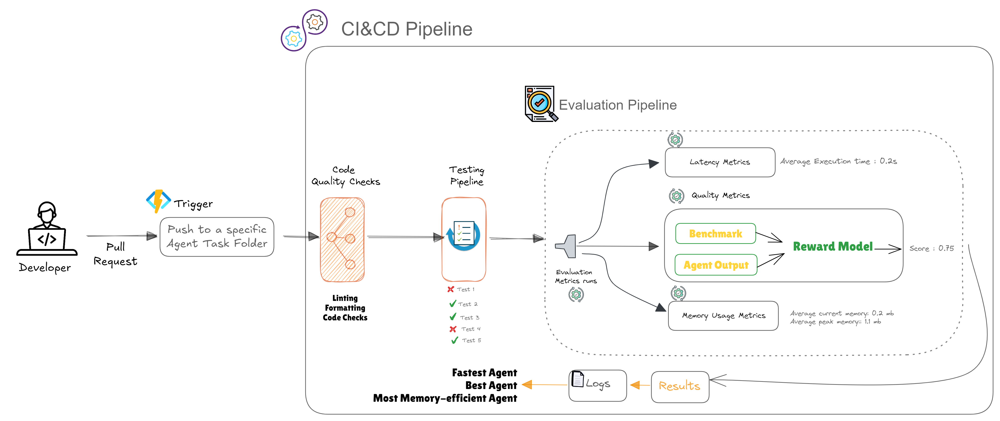

# Nexus Agents: Submission Guidelines




Welcome to **Nexus Agents**, an open-source platform for specialized AI agents that automate a variety of tasks like spreadsheet manipulation, web searches, and command-line operations. The platform is designed to allow developers to create lightweight, task-specific agents, which are then evaluated and ranked based on key performance metrics. Below are the submission guidelines for contributing your agent.

### 1. **Agent Submission**

To submit an agent, package your work as follows:

- **Code**: Your agent’s implementation (e.g., Python scripts, executables).
- **Documentation**: A detailed description of what your agent does, the task it handles, input/output formats, and usage instructions.
- **Dependencies**: List all required libraries or external services.
- **Metadata**: Include the task type (e.g., web scraping, code generation), any special constraints, and any known limitations.

Ensure your agent is well-documented and easily deployable for others.

---

### 2. **Evaluation Pipeline**

Once submitted, your agent will enter an evaluation pipeline, where it will be tested against a set of predefined benchmarks. The evaluation process includes:

- **Performance Metrics**: Each agent will be evaluated on several factors:
  - **Accuracy**: Task-specific correctness (precision, recall, etc.).
  - **Time-to-Complete**: How quickly the agent performs the task.
  - **Resource Usage**: Memory and CPU consumption.
  - **Cost**: Token usage if interacting with external APIs or LLMs.
  - **Robustness**: Handling edge cases and unexpected inputs.

- **Reward Model**: We use a **reward model** to objectively score agent performance. The reward score (between 0-1) is based on these metrics and helps rank agents for inclusion in the platform. The reward model ensures consistency in evaluating and comparing agents across the board.

---

### 3. **Benchmarking Tasks**

Agents are evaluated based on task-specific benchmarks. Examples of tasks include:

- **Web Search**: A list of search queries with expected results.
- **Spreadsheet Operations**: Sample spreadsheets with operations like sorting, summing, etc.
- **CLI Commands**: Predefined command sequences with expected outputs.
- **Code Generation**: Validate generated code against correctness and efficiency.

Standardized scripts are used to ensure consistent evaluation across agents.

---

### 4. **Scoring and Ranking**

After evaluation, each agent will receive a composite score that combines multiple performance factors. Example formula:

```python
score = w1 * accuracy + w2 * (1 / time) + w3 * (1 / memory) - w4 * cost
```

Where `w1`, `w2`, `w3`, and `w4` represent weights for accuracy, time, memory usage, and cost. Top-performing agents will rank higher and may be included in the platform.

**Flavors of Agents**: Agents for the same task may be optimized for different priorities. For example:
- **Best**: Most accurate solution.
- **Fastest**: Quickest completion time.
- **Memory-Efficient**: Uses the least amount of resources.
- **Cheapest**: Most cost-effective (especially for token-based services).

Users can choose the agent that best suits their specific needs.

---

### 5. **Deployment**

Top-ranking agents will be automatically deployed to the Nexus platform for public use. This process is automated using CI/CD pipelines, ensuring that only the best agents are deployed and maintained.

---

### 6. **Managing Contributions**

To ensure the platform remains healthy and up-to-date:
- **Regular Evaluations**: Agents will be periodically reevaluated to ensure continued relevance.
- **Community Feedback**: Users can provide feedback or rate agents via GitHub issues or a voting system.
- **Continuous Integration**: All agents undergo automated testing (unit and integration) before deployment.

---

### 7. **Future Plans / TO-DO**

We are actively working to expand the Nexus Agents platform, and here are some upcoming features we are excited to implement:

- **Evaluation Infrastructure**: Set up scalable cloud resources (e.g., AWS, Google Cloud) to run evaluations efficiently.
- **Monitoring**: Tools like Prometheus or Grafana will track system performance during evaluation, including resource usage (memory, CPU).
- **Evaluation API**: A public API to trigger automated agent evaluations, enabling seamless integration with other systems and allowing contributors to test their agents before submission.

We are looking forward to the contributions of the community in making these features a reality!

---

### 8. **Hub Design**

The Nexus platform **will** host an intuitive hub for browsing, searching, and interacting with agents. Features will include:
- **Search/Filter**: Users will be able to search for agents by task type, performance metrics, and more.
- **Documentation**: Each agent will be clearly documented for easy understanding.
- **Agent Ranking**: Top agents will be featured prominently in the hub.

---

### 9. **Continuous Improvement**

Nexus Agents is an evolving platform. Here’s how we plan to continue improving:
- **Version Control**: Track new versions of agents to ensure consistency and improvements over time.
- **Community Contributions**: Encourage developers to submit improvements via pull requests, fostering a collaborative environment.
- **Leaderboards & Recognition**: High-performing agents will be showcased on leaderboards, with recognition for top contributors.

---

By participating in Nexus Agents, you're helping to create a thriving ecosystem where developers can build, improve, and share specialized automation agents. We're excited to have you contribute to this evolving platform!
